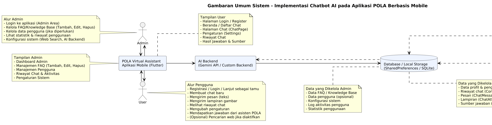
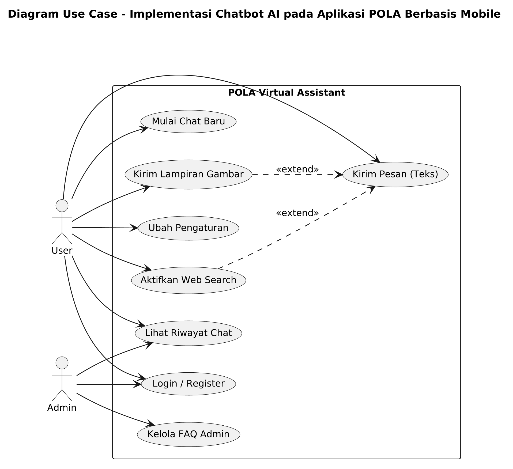
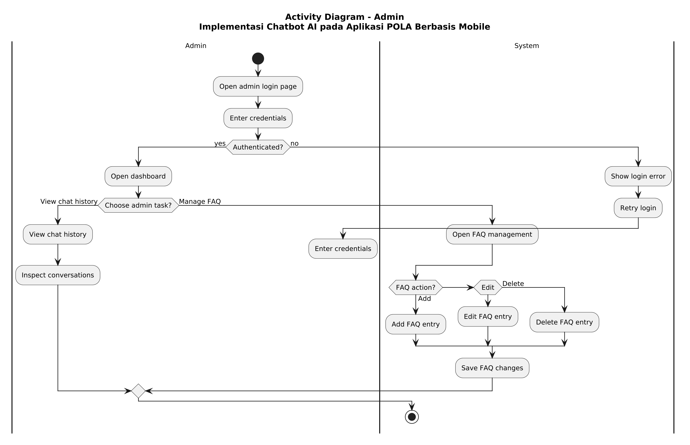
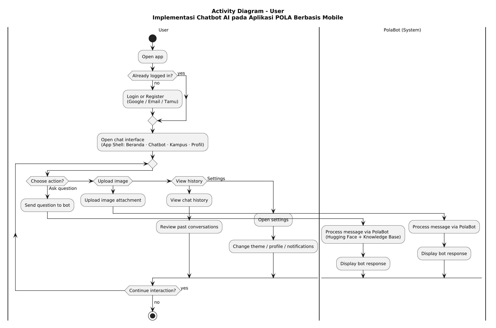
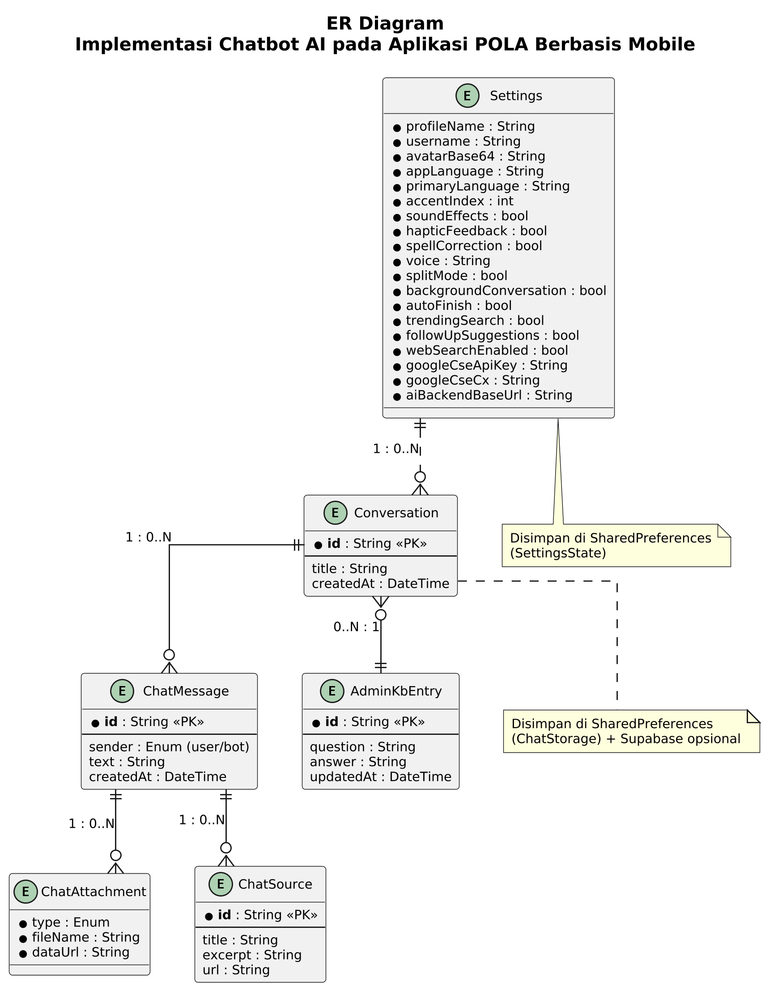
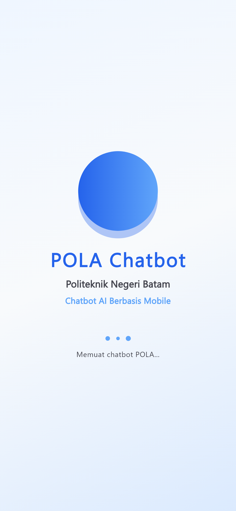
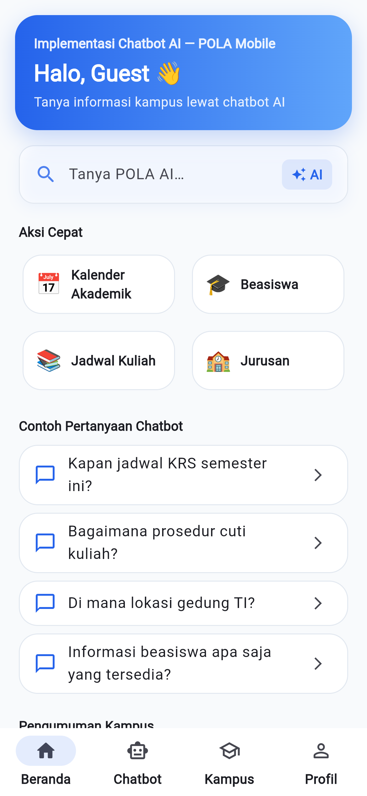
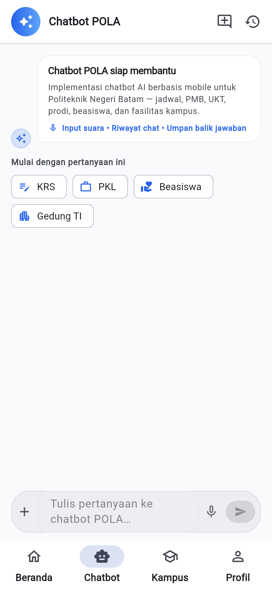
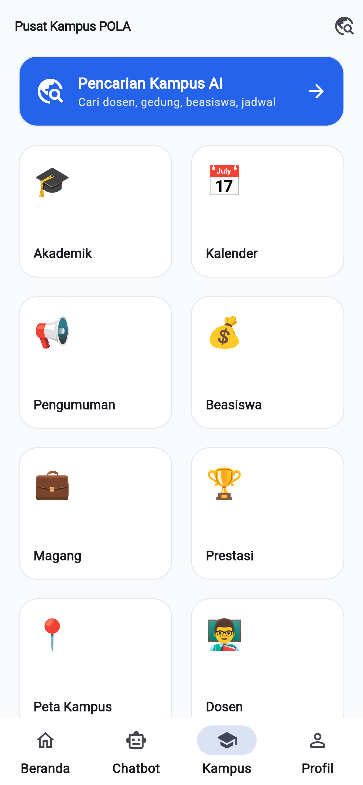
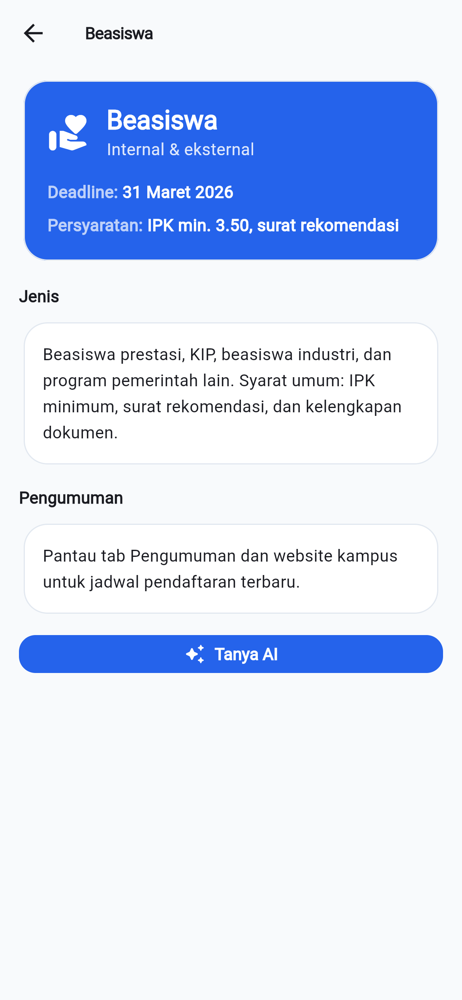

# BAB III PERANCANGAN SISTEM

**Judul Proyek:** Implementasi Chatbot AI pada Aplikasi POLA Berbasis Mobile  
**Institusi:** Politeknik Negeri Batam  
**Versi Aplikasi:** POLA v1.0.0 · App Shell v8

Bab ini menjelaskan perancangan sistem chatbot AI mobile POLA (*Polibatam Assistant*) — **bukan** virtual assistant generik, melainkan implementasi chatbot AI terintegrasi pada aplikasi mobile untuk informasi kampus Polibatam.

---

## 3.1 Arsitektur Sistem

Aplikasi POLA menggunakan arsitektur **client–server** dengan chatbot AI sebagai fitur inti:

| Lapisan | Teknologi | Fungsi |
|---------|-----------|--------|
| Presentasi | Flutter 3.x (Android, Web, Windows) | UI: Beranda, Chatbot, Kampus, Profil |
| Logika Aplikasi | Dart (ChangeNotifier) | AuthState, ChatState, SettingsState, BookmarkState |
| Backend AI | Node.js + Express + Hugging Face Router | Pemrosesan chat, PolaBot, basis pengetahuan |
| Penyimpanan | SharedPreferences + Supabase (opsional) | Riwayat chat, profil, FAQ admin |

### Gambar 3.1 Gambaran Umum Sistem

*Gambar 3.1 — Arsitektur Implementasi Chatbot AI pada Aplikasi POLA Berbasis Mobile. Admin mengelola FAQ dan konfigurasi; pengguna berinteraksi via aplikasi mobile Flutter yang terhubung ke AI Backend, knowledge base lokal, dan storage.*

---

## 3.2 Perancangan Fungsional

### 3.2.1 Kebutuhan Fungsional

Tabel berikut merangkum kebutuhan fungsional proyek POLA (format ID FR, disesuaikan dengan fitur chatbot mobile — **bukan** aplikasi kesehatan):

**Tabel 3.1 Kebutuhan Fungsional Sistem POLA**

| ID | Kebutuhan Fungsional | Skenario Pengujian | Hasil yang Diharapkan | Status |
|----|----------------------|--------------------|-----------------------|--------|
| FR-01 | User dapat masuk ke aplikasi menggunakan akun Google | Pengguna menekan **Lanjutkan dengan Google** dan memilih akun valid | Pengguna berhasil masuk; profil dimuat | Berhasil |
| FR-02 | User dapat login dan register dengan email/password | Pengguna mengisi email & password lalu tap Masuk/Daftar | Akun terautentikasi via Supabase | Berhasil |
| FR-03 | User dapat melanjutkan sebagai tamu | Pengguna memilih **Lanjut sebagai Tamu** | Aplikasi dapat dipakai tanpa login cloud | Berhasil |
| FR-04 | User dapat melihat onboarding aplikasi | Pengguna pertama kali buka app setelah splash | 3 slide onboarding tampil; tap Mulai → beranda | Berhasil |
| FR-05 | User dapat melihat ringkasan beranda (dashboard) | Pengguna buka tab Beranda | Hero banner, aksi cepat, contoh pertanyaan, pengumuman tampil | Berhasil |
| FR-06 | User dapat berkonsultasi dengan AI Chatbot | Pengguna kirim pertanyaan seputar Polibatam | Chatbot memberikan jawaban relevan via backend AI | Berhasil |
| FR-07 | User dapat mengirim pesan teks ke chatbot | Ketik pertanyaan → tap kirim | Pesan user & jawaban bot tampil di bubble chat | Berhasil |
| FR-08 | User dapat menggunakan input suara (speech-to-text) | Tap ikon mikrofon → ucapkan pertanyaan | Teks transkripsi muncul di input bar | Berhasil |
| FR-09 | User dapat mengirim lampiran gambar | Tap lampiran → pilih gambar → kirim | Gambar terlampir pada pesan chat | Berhasil |
| FR-10 | User dapat memulai percakapan chat baru | Tap ikon **Chat baru** di header chatbot | Sesi chat baru aktif; riwayat terpisah | Berhasil |
| FR-11 | User dapat melihat riwayat percakapan chat | Buka Riwayat Chat dari Profil/header | Daftar conversation tampil; dapat dipilih | Berhasil |
| FR-12 | User dapat melihat daftar modul informasi kampus | Buka tab Kampus | Grid 8 modul (Akademik, Beasiswa, Magang, dll.) | Berhasil |
| FR-13 | User dapat melihat detail informasi modul kampus | Tap modul Beasiswa (contoh) | Konten detail + tombol Tanya Chatbot | Berhasil |
| FR-14 | User dapat melakukan pencarian info kampus AI | Buka Pencarian Kampus AI | Query diteruskan ke chatbot | Berhasil |
| FR-15 | User dapat melihat pengumuman kampus | Scroll pengumuman di Beranda | Kartu pengumuman dapat dibuka | Berhasil |
| FR-16 | User dapat menyimpan jawaban chatbot (bookmark) | Tap bookmark pada bubble jawaban bot | Jawaban tersimpan di halaman Bookmark | Berhasil |
| FR-17 | User dapat melihat informasi profil | Buka tab Profil | Nama, email/tamu, prodi, avatar tampil | Berhasil |
| FR-18 | User dapat mengedit data profil | Tap Edit Profil → ubah NIM/prodi → simpan | Data profil tersimpan di perangkat | Berhasil |
| FR-19 | User dapat mengubah pengaturan aplikasi | Buka Pengaturan → ubah tema/haptik/warna | Preferensi langsung diterapkan | Berhasil |
| FR-20 | User dapat mengaktifkan/menonaktifkan notifikasi | Toggle notifikasi di pengaturan | Status notifikasi diperbarui | Berhasil |
| FR-21 | User dapat menggunakan pertanyaan cepat (quick prompts) | Tap chip pertanyaan di Beranda/Chatbot | Pertanyaan otomatis terkirim ke chatbot | Berhasil |
| FR-22 | User dapat melihat status koneksi backend AI | Buka tab Chatbot saat server mati/nyala | Banner offline atau chat normal | Berhasil |
| FR-23 | Admin dapat kelola FAQ basis pengetahuan | Admin buka panel → tambah/edit/hapus FAQ | FAQ tersimpan & dipakai chatbot | Berhasil |
| FR-24 | User dapat keluar (logout) dari aplikasi | Profil/Pengaturan → Keluar → konfirmasi | Sesi berakhir; kembali mode tamu | Berhasil |
| FR-25 | User dapat melihat detail pengumuman kampus | Tap kartu pengumuman di Beranda | Halaman detail pengumuman tampil | Berhasil |

### 3.2.2 Kebutuhan Non-Fungsional

**Tabel 3.2 Kebutuhan Non-Fungsional**

| No | Aspek | Deskripsi |
|----|-------|-----------|
| NF-01 | Performa | Respons chat ≤ 15 detik (bergantung backend AI) |
| NF-02 | Ketersediaan | Riwayat chat lokal tetap terbaca saat offline |
| NF-03 | Keamanan | Token API di server; OAuth via Supabase |
| NF-04 | Portabilitas | Satu codebase Flutter — Android, Web, Windows |
| NF-05 | Usability | Navigasi 4 tab, Material Design 3, tema gelap |
| NF-06 | Relevansi AI | Jawaban difokuskan konteks Polibatam |

---

### 3.2.3 Diagram Use Case

Diagram use case menggambarkan interaksi **User** dan **Admin** dengan sistem chatbot AI mobile POLA (simbol UML standar).

**Gambar 3.2 Diagram Use Case — Implementasi Chatbot AI pada Aplikasi POLA Berbasis Mobile**

| Kode | Use Case | Aktor |
|------|----------|-------|
| UC-001 | Login / Register / Lanjut sebagai Tamu | User, Admin |
| UC-002 | Mulai Chat Baru | User |
| UC-003 | Kirim Pesan Teks | User |
| UC-004 | Kirim Lampiran Gambar | User |
| UC-005 | Lihat Riwayat Chat | User |
| UC-006 | Lihat Informasi Kampus | User |
| UC-007 | Simpan Bookmark | User |
| UC-008 | Ubah Pengaturan | User |
| UC-009 | Kelola FAQ Admin | Admin |

---

### 3.2.4 Skenario Use Case

Skenario use case berikut disusun berdasarkan implementasi aplikasi POLA yang telah dibuat, mencakup alur login, chat AI, riwayat percakapan, informasi kampus, bookmark, pengaturan, serta manajemen FAQ oleh admin.

#### Tabel 3.3 Skenario UC-001 — Login, Register, dan Lanjut sebagai Tamu

| Identifikasi | |
|---|---|
| **Nomor** | UC-001 |
| **Nama** | Login / Register / Lanjut sebagai Tamu |
| **Tujuan** | Memungkinkan pengguna mengakses aplikasi dengan akun valid, akun baru, atau mode tamu |
| **Aktor** | User, Admin |
| **Kondisi Awal** | Pengguna membuka aplikasi dan berada pada halaman autentikasi |
| **Skenario Utama** | 1. Pengguna memilih masuk dengan Google, email/password, atau lanjut sebagai tamu. 2. Sistem memverifikasi kredensial atau mengizinkan akses tamu. 3. Jika berhasil, pengguna diarahkan ke halaman utama aplikasi POLA. |
| **Skenario Alternatif** | Kredensial salah, akun belum terdaftar, proses Google dibatalkan, atau pengguna memilih kembali ke halaman login. |
| **Kondisi Akhir** | Pengguna berhasil masuk ke aplikasi atau tetap menggunakan mode tamu. |

#### Tabel 3.4 Skenario UC-002 — Mulai Chat Baru

| Identifikasi | |
|---|---|
| **Nomor** | UC-002 |
| **Nama** | Mulai Chat Baru |
| **Tujuan** | Memulai percakapan baru dengan chatbot POLA |
| **Aktor** | User |
| **Kondisi Awal** | Pengguna berada pada tab Chatbot |
| **Skenario Utama** | 1. Pengguna menekan tombol chat baru. 2. Sistem membuat sesi percakapan baru. 3. Halaman chat kosong ditampilkan untuk memulai interaksi. |
| **Skenario Alternatif** | Penyimpanan riwayat gagal atau sesi chat tidak dapat dibuat. |
| **Kondisi Akhir** | Percakapan baru siap digunakan. |

#### Tabel 3.5 Skenario UC-003 — Kirim Pesan Teks

| Identifikasi | |
|---|---|
| **Nomor** | UC-003 |
| **Nama** | Kirim Pesan Teks |
| **Tujuan** | Mengirim pertanyaan kepada chatbot dan menerima jawaban AI |
| **Aktor** | User |
| **Kondisi Awal** | Pengguna berada pada sesi chat aktif |
| **Skenario Utama** | 1. Pengguna mengetik pertanyaan terkait informasi Polibatam. 2. Pengguna menekan tombol kirim. 3. Sistem mengirim pesan ke backend AI PolaBot. 4. Jawaban chatbot ditampilkan dalam bubble chat. 5. Pesan dan jawaban disimpan ke riwayat chat. |
| **Skenario Alternatif** | Pesan kosong, koneksi backend bermasalah, atau server AI tidak tersedia. |
| **Kondisi Akhir** | Jawaban chatbot tampil dan riwayat chat tersimpan. |

#### Tabel 3.6 Skenario UC-004 — Kirim Lampiran Gambar

| Identifikasi | |
|---|---|
| **Nomor** | UC-004 |
| **Nama** | Kirim Lampiran Gambar |
| **Tujuan** | Mengirim gambar sebagai konteks pertanyaan chatbot |
| **Aktor** | User |
| **Kondisi Awal** | Pengguna berada pada halaman chat |
| **Skenario Utama** | 1. Pengguna memilih tombol lampiran. 2. Pengguna memilih gambar dari galeri atau kamera. 3. Sistem menambahkan lampiran ke pesan chat. 4. Pesan beserta gambar dikirimkan ke proses AI untuk dianalisis. |
| **Skenario Alternatif** | Pengguna membatalkan pemilihan gambar atau format file tidak didukung. |
| **Kondisi Akhir** | Gambar berhasil dikirim dan diproses oleh chatbot. |

#### Tabel 3.7 Skenario UC-005 — Lihat Riwayat Chat

| Identifikasi | |
|---|---|
| **Nomor** | UC-005 |
| **Nama** | Lihat Riwayat Chat |
| **Tujuan** | Meninjau percakapan sebelumnya yang telah tersimpan |
| **Aktor** | User |
| **Kondisi Awal** | Pengguna pernah melakukan interaksi chat |
| **Skenario Utama** | 1. Pengguna membuka menu riwayat chat. 2. Sistem menampilkan daftar percakapan yang tersedia. 3. Pengguna memilih salah satu percakapan. 4. Isi percakapan tersebut ditampilkan kembali. |
| **Skenario Alternatif** | Riwayat chat masih kosong atau data tidak berhasil dibaca. |
| **Kondisi Akhir** | Percakapan sebelumnya dapat dilihat kembali. |

#### Tabel 3.8 Skenario UC-006 — Lihat Informasi Kampus

| Identifikasi | |
|---|---|
| **Nomor** | UC-006 |
| **Nama** | Lihat Informasi Kampus |
| **Tujuan** | Menampilkan modul informasi kampus seperti akademik, beasiswa, magang, dan layanan lainnya |
| **Aktor** | User |
| **Kondisi Awal** | Pengguna berada pada tab Kampus |
| **Skenario Utama** | 1. Pengguna membuka tab Kampus. 2. Sistem menampilkan daftar modul informasi. 3. Pengguna memilih modul yang diinginkan. 4. Detail informasi ditampilkan lengkap beserta opsi tanya chatbot. |
| **Skenario Alternatif** | Modul belum tersedia atau konten gagal dimuat. |
| **Kondisi Akhir** | Informasi kampus berhasil ditampilkan. |

#### Tabel 3.9 Skenario UC-007 — Simpan Bookmark

| Identifikasi | |
|---|---|
| **Nomor** | UC-007 |
| **Nama** | Simpan Bookmark |
| **Tujuan** | Menyimpan jawaban chatbot yang dianggap penting |
| **Aktor** | User |
| **Kondisi Awal** | Pengguna menerima jawaban chatbot |
| **Skenario Utama** | 1. Pengguna menekan tombol bookmark pada jawaban chatbot. 2. Sistem menyimpan pertanyaan dan jawaban ke daftar bookmark pengguna. 3. Bookmark dapat dibuka kembali dari halaman profil atau menu bookmark. |
| **Skenario Alternatif** | Bookmark gagal disimpan karena error penyimpanan lokal. |
| **Kondisi Akhir** | Jawaban chatbot tersimpan sebagai bookmark. |

#### Tabel 3.10 Skenario UC-008 — Ubah Pengaturan

| Identifikasi | |
|---|---|
| **Nomor** | UC-008 |
| **Nama** | Ubah Pengaturan |
| **Tujuan** | Mengubah preferensi aplikasi seperti tema, bahasa, warna, dan notifikasi |
| **Aktor** | User |
| **Kondisi Awal** | Pengguna berada pada halaman Pengaturan |
| **Skenario Utama** | 1. Pengguna membuka halaman Pengaturan. 2. Pengguna mengubah preferensi yang diinginkan. 3. Sistem menyimpan perubahan ke penyimpanan lokal aplikasi. |
| **Skenario Alternatif** | Pengguna membatalkan perubahan atau terjadi error saat menyimpan. |
| **Kondisi Akhir** | Pengaturan diterapkan sesuai pilihan pengguna. |

#### Tabel 3.11 Skenario UC-009 — Kelola FAQ Admin

| Identifikasi | |
|---|---|
| **Nomor** | UC-009 |
| **Nama** | Kelola FAQ Admin |
| **Tujuan** | Mengelola basis pengetahuan chatbot oleh admin |
| **Aktor** | Admin |
| **Kondisi Awal** | Admin telah login sebagai administrator |
| **Skenario Utama** | 1. Admin membuka panel admin. 2. Admin menambah, mengedit, atau menghapus data FAQ. 3. Sistem menyimpan perubahan ke basis pengetahuan yang digunakan chatbot. |
| **Skenario Alternatif** | Admin tidak memiliki hak akses, data kosong, atau penyimpanan gagal. |
| **Kondisi Akhir** | FAQ admin berhasil diperbarui dan dipakai sistem. |

---

### 3.2.5 Activity Diagram

#### Gambar 3.3 Activity Diagram Admin

Alur admin: login → dashboard → kelola FAQ (tambah/edit/hapus) atau lihat riwayat chat.

#### Gambar 3.4 Activity Diagram User

Alur pengguna: buka app → login/tamu → chat interface → kirim pertanyaan/gambar → PolaBot memproses → tampilkan jawaban → riwayat/pengaturan/info kampus.

---

### 3.2.6 ER Diagram

ERD menggambarkan struktur data chatbot AI mobile POLA: percakapan, pesan, lampiran, sumber jawaban, pengaturan, FAQ admin, dan bookmark.

**Gambar 3.5 ER Diagram — Implementasi Chatbot AI pada Aplikasi POLA Berbasis Mobile**

**Entitas utama:**

1. **Settings** — profil, bahasa, tema, web search, URL backend AI  
2. **Conversation** — id, title, createdAt  
3. **ChatMessage** — id, sender, text, createdAt  
4. **ChatAttachment** — type, fileName, dataUrl  
5. **ChatSource** — id, title, excerpt, url  
6. **AdminKbEntry** — id, question, answer, updatedAt  
7. **BookmarkItem** — id, question, answer, savedAt  

**Tabel 3.11 Hubungan Antar Entitas**

| No | Entitas 1 | Relasi | Entitas 2 | Kardinalitas | Penjelasan |
|----|-----------|--------|-----------|--------------|------------|
| 1 | Settings | Digunakan oleh | Conversation | 1 : N | Satu pengguna banyak percakapan |
| 2 | Conversation | Memiliki | ChatMessage | 1 : N | Satu conversation banyak pesan |
| 3 | ChatMessage | Memiliki | ChatAttachment | 1 : N | Satu pesan banyak lampiran |
| 4 | ChatMessage | Menggunakan | ChatSource | 1 : N | Satu pesan banyak sumber |
| 5 | AdminKbEntry | Dikelola oleh | Admin | N : 1 | FAQ dikelola admin |
| 6 | Settings | Memiliki | BookmarkItem | 1 : N | Bookmark per pengguna |

---

### 3.2.7 Perancangan Antarmuka (Wireframe)

Wireframe menggunakan **screenshot aplikasi aktual** (390×844, scale 3×) agar tajam dan sesuai implementasi.

#### Gambar 3.6 Wireframe Splash Screen

#### Gambar 3.7 Wireframe Onboarding

#### Gambar 3.8 Wireframe Beranda (Dashboard)

Fitur: hero banner, aksi cepat, contoh pertanyaan chatbot, pengumuman kampus, navigasi 4 tab.

#### Gambar 3.9 Wireframe Chatbot (Kosong)

#### Gambar 3.10 Wireframe Chatbot (Jawaban AI)

#### Gambar 3.11 Wireframe Kampus Hub

#### Gambar 3.12 Wireframe Detail Modul Kampus

#### Gambar 3.13 Wireframe Profil

#### Gambar 3.14 Wireframe Login / Register

#### Gambar 3.15 Wireframe Pengaturan

---

## 3.3 Kesimpulan Perancangan

Perancangan **Implementasi Chatbot AI pada Aplikasi POLA Berbasis Mobile** meliputi arsitektur client–server, 25 kebutuhan fungsional (FR-01–FR-25), 8 use case inti, activity diagram admin/user, ERD, dan wireframe dari aplikasi v1.0.0. Dokumen ini menjadi acuan BAB IV (Implementasi dan Pengujian).

---

*Regenerasi diagram: `node docs/bab3/generate_diagrams.mjs`*  
*Regenerasi wireframe: `node docs/bab3/copy_wireframes.mjs`*
