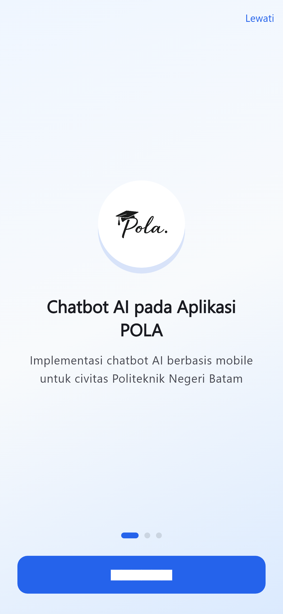
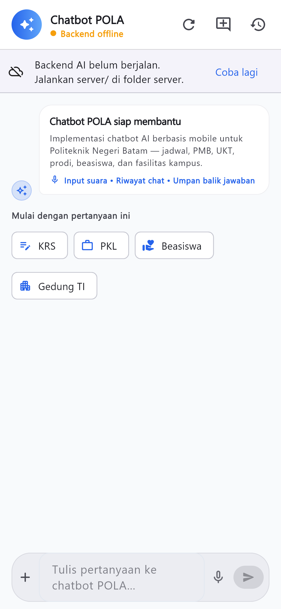
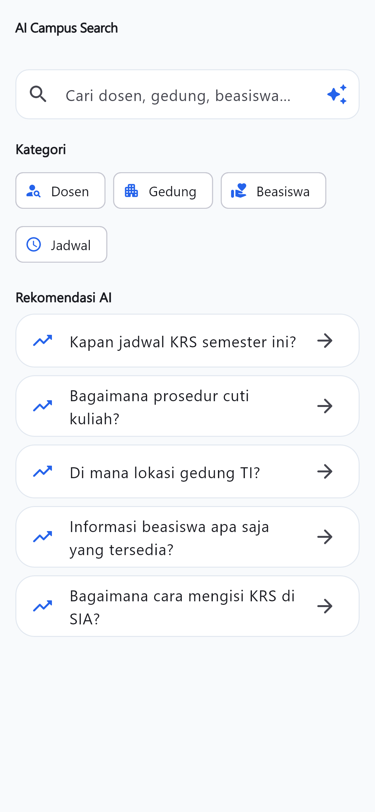
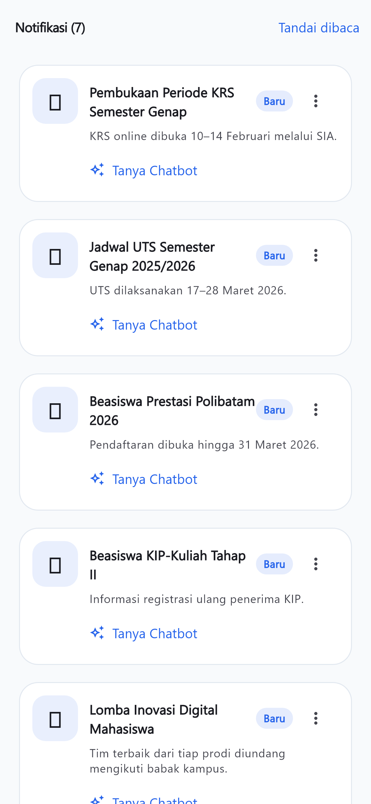
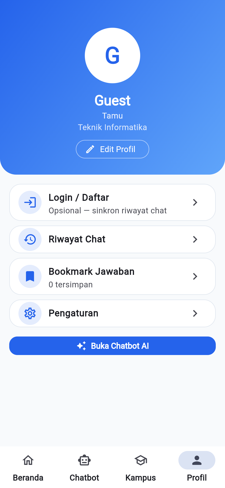
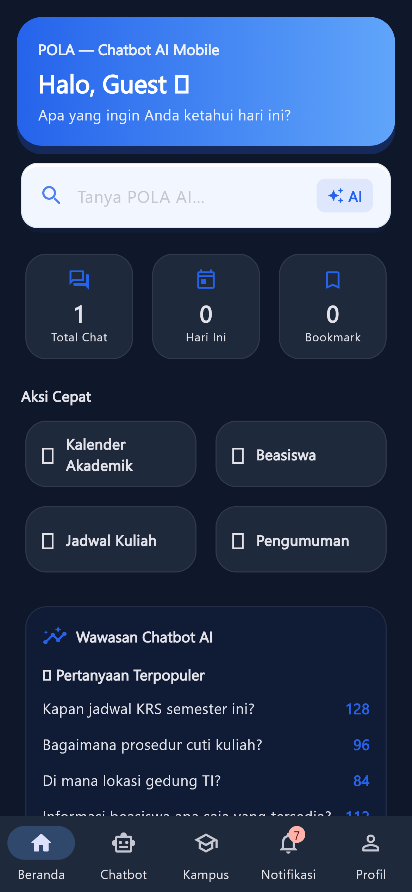
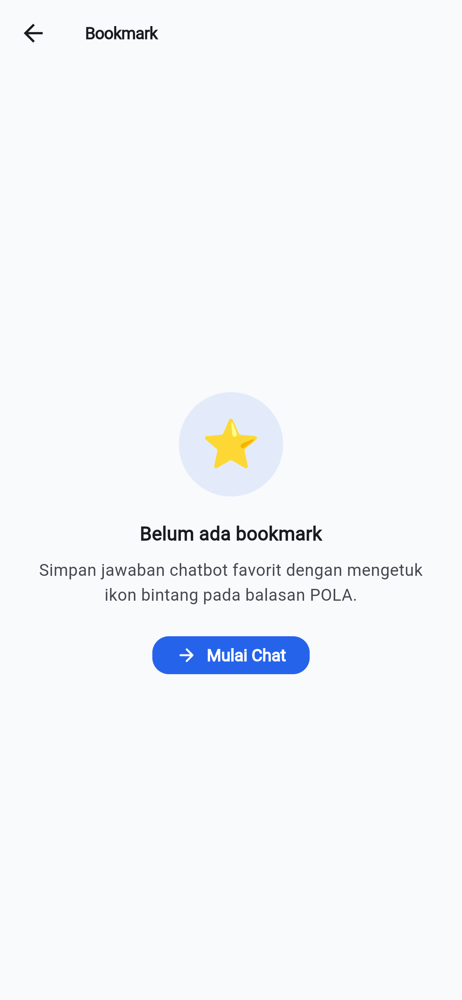
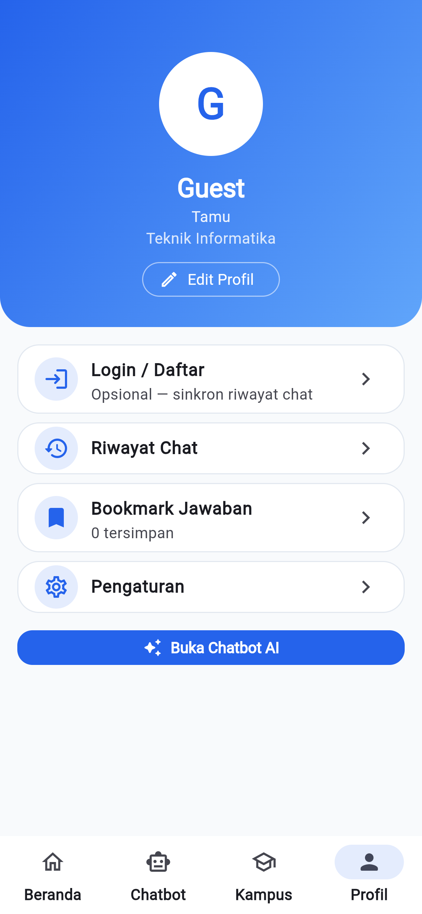
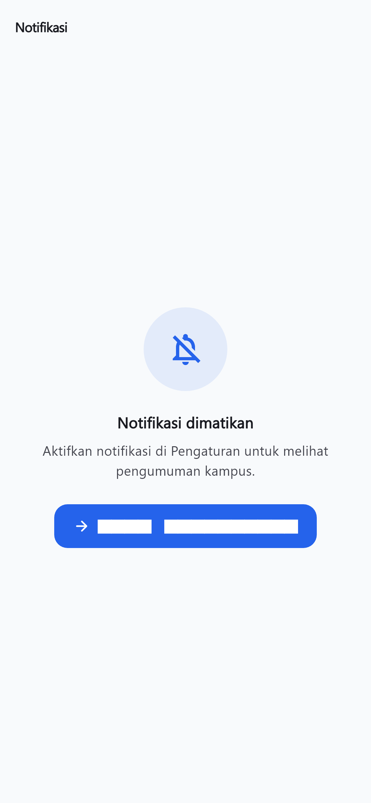
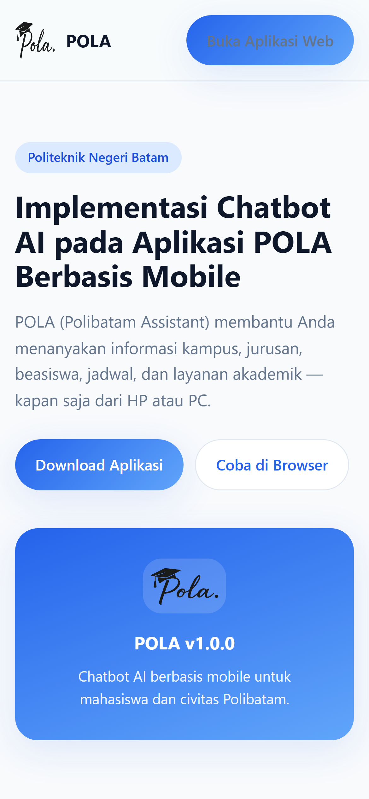

# BAB IV
# IMPLEMENTASI DAN PENGUJIAN

**Judul Proyek:** Implementasi Chatbot AI pada Aplikasi POLA Berbasis Mobile  
**Kode PBL:** IF-4MB-06  
**Program Studi:** D-III Teknik Informatika  
**Institusi:** Politeknik Negeri Batam  
**Anggota Tim:** Muhammad Nabil (3312411007), Bindhu Owen Batami Hutagalung (3312411017)

---

Proyek ini termasuk dalam ruang lingkup **pengembangan perangkat lunak** dengan integrasi kecerdasan buatan (AI). Oleh karena itu, Bab IV disusun dengan subbab **4.1 Hasil Implementasi** dan **4.2 Pengujian** sesuai pedoman penulisan laporan PBL Program Studi Teknik Informatika.

---

## 4.1 Hasil Implementasi

Bagian ini menjelaskan hasil implementasi sistem **POLA (Polibatam Assistant)** — aplikasi mobile berbasis Flutter yang mengintegrasikan chatbot AI untuk layanan informasi kampus Politeknik Negeri Batam. Tujuan bagian ini adalah menunjukkan bahwa produk telah terbangun sesuai rancangan dan siap diuji serta didemonstrasikan.

### 4.1.1 Proses Implementasi

Implementasi dilakukan secara bertahap dengan metode pengembangan iteratif. Tahapan yang dilaksanakan:

**a. Persiapan lingkungan pengembangan**

- Instalasi Flutter SDK, Dart, Node.js (v18+), dan Android Studio / VS Code.
- Inisialisasi proyek Flutter di folder `lib/` dan backend AI di folder `server/`.
- Konfigurasi variabel lingkungan (`.env`) untuk Supabase, URL backend, dan kredensial API AI.

**b. Perancangan dan pengembangan antarmuka**

- Desain antarmuka mobile-first dengan Material Design 3.
- Pembangunan shell aplikasi 4 tab: **Beranda**, **Chatbot**, **Kampus**, dan **Profil**.
- Implementasi halaman splash, onboarding (3 slide), dan navigasi antar modul.

**c. Implementasi chatbot AI**

- Pembuatan backend Node.js Express pada port **8787**.
- Integrasi API **KoboiLLM** (model `gemini/gemini-2.5-flash`) untuk pemrosesan pertanyaan.
- Penyusunan knowledge base kampus (`dataset_custom.txt`, `campus_catalog.dart`).
- Mekanisme fallback ke knowledge base lokal jika backend/API tidak tersedia.

**d. Implementasi fitur pendukung**

- Modul informasi kampus (8 kategori).
- Riwayat chat, bookmark jawaban, pengaturan (mode gelap, warna aksen).
- Login/register opsional via Supabase Auth.

**e. Penyebaran (deployment) lokal**

- Build aplikasi web: `flutter build web --base-href="/app/"`.
- Penyediaan landing page dan APK melalui folder `releases/POLA-website/`.
- Script otomatis: `JALANKAN_DEMO.bat`, `scripts/serve_website.ps1`.

**Tabel 4.1 Ringkasan Teknologi Implementasi**

| Komponen | Teknologi | Keterangan |
|----------|-----------|------------|
| Frontend | Flutter 3.x, Dart | Aplikasi mobile & web |
| Backend AI | Node.js, Express | REST API `/v1/chat`, `/health` |
| Model AI | KoboiLLM / Gemini 2.5 Flash | Pemrosesan bahasa natural |
| Autentikasi | Supabase Auth | Login email & Google (opsional) |
| Penyimpanan lokal | SharedPreferences | Profil, riwayat, pengaturan |
| Hosting lokal | Python HTTP / script PowerShell | Port 8080/8081 |

---

### 4.1.2 Arsitektur Sistem

Sistem POLA dibangun dengan arsitektur client–server. Aplikasi Flutter berperan sebagai klien, backend Node.js sebagai perantara AI, dan API eksternal sebagai penyedia model bahasa.

```
┌─────────────────────────────────────────┐
│         Pengguna (Mobile / Web)         │
└──────────────────┬──────────────────────┘
                   │
                   ▼
┌─────────────────────────────────────────┐
│           Aplikasi Flutter POLA         │
│  ┌─────────┬─────────┬─────────┬──────┐ │
│  │ Beranda │ Chatbot │ Kampus  │Profil│ │
│  └─────────┴─────────┴─────────┴──────┘ │
└──────────────────┬──────────────────────┘
                   │ HTTP POST /v1/chat
                   ▼
┌─────────────────────────────────────────┐
│        Backend Node.js (port 8787)      │
│     Prompt + Knowledge Base + History   │
└──────────────────┬──────────────────────┘
                   │
         ┌─────────┴─────────┐
         ▼                   ▼
┌─────────────────┐  ┌──────────────────┐
│  KoboiLLM API   │  │ Knowledge Base   │
│ (Gemini Flash)  │  │ Lokal Polibatam  │
└─────────────────┘  └──────────────────┘
```

---

### 4.1.3 Tampilan Hasil Implementasi

Berikut tampilan antarmuka hasil implementasi beserta penjelasan fungsi setiap layar. Seluruh gambar diambil dari hasil capture perangkat langsung (resolusi tinggi) agar tampilan tetap tajam dan tidak blur saat dicetak ke PDF laporan.

---

**Gambar 4.1 Splash Screen**


Halaman pembuka aplikasi sebelum masuk onboarding/beranda.

---

**Gambar 4.2 Onboarding**



Layar pengenalan fitur utama POLA sebelum pengguna mulai menggunakan aplikasi.

---

**Gambar 4.3 Beranda (Dashboard)**


Halaman utama berisi ringkasan, quick action, dan shortcut menuju chatbot AI.

---

**Gambar 4.4 Chatbot AI (Kosong)**


Tampilan awal modul chatbot sebelum pengguna mengirim pertanyaan.

---

**Gambar 4.5 Chatbot AI (Jawaban)**


Contoh tampilan percakapan setelah bot memberikan respons.

---

**Gambar 4.6 Quick Prompts Chatbot**



Daftar pertanyaan cepat untuk mempercepat interaksi dengan chatbot.

---

**Gambar 4.7 Pusat Kampus**


Halaman katalog modul informasi kampus (akademik, beasiswa, pengumuman, dll.).

---

**Gambar 4.8 Detail Beasiswa**


Halaman detail modul beasiswa berikut tombol aksi untuk bertanya ke AI.

---

**Gambar 4.9 Pencarian Kampus AI**



Tampilan fitur pencarian informasi kampus berbasis AI.

---

**Gambar 4.10 Notifikasi Aktif**



Contoh kondisi saat pengaturan notifikasi dalam keadaan aktif.

---

**Gambar 4.11 Profil Pengguna**



Halaman profil berisi data akun, riwayat chat, bookmark, dan menu personal.

---

**Gambar 4.12 Mode Gelap**



Contoh tampilan antarmuka aplikasi saat tema gelap diaktifkan.

---

**Gambar 4.13 Halaman Login**



Halaman autentikasi pengguna untuk login/register.

---

**Gambar 4.14 Halaman Pengaturan**



Menu pengaturan untuk preferensi aplikasi (tema, notifikasi, akun, dan lain-lain).

---

**Gambar 4.15 Notifikasi Nonaktif**



Contoh kondisi saat pengaturan notifikasi dinonaktifkan.

---

**Gambar 4.16 Landing Page Website POLA**



Halaman publik untuk informasi proyek, unduhan aplikasi, dan akses versi web.

---

### 4.1.4 Alur Penggunaan Sistem

Contoh alur penggunaan aplikasi mobile POLA:

**Alur 1 — Akses informasi via Beranda**
```
Buka aplikasi → Splash → Onboarding (skip) → Beranda
→ Ketuk "Informasi beasiswa apa saja yang tersedia?"
→ Otomatis pindah ke Chatbot → AI menjawab → Bookmark (opsional)
```

**Alur 2 — Akses via modul Kampus**
```
Beranda → Tab Kampus → Pilih modul Beasiswa
→ Baca informasi → Ketuk "Tanya AI"
→ Chatbot terbuka dengan konteks beasiswa → AI menjawab
```

**Alur 3 — Login dan personalisasi (opsional)**
```
Tab Profil → Login/Daftar → Isi email & password
→ Masuk → Edit Profil → Pengaturan (mode gelap)
→ Riwayat Chat / Bookmark
```

**Alur 4 — Pengguna tamu (tanpa login)**
```
Buka aplikasi → Langsung gunakan Beranda / Chatbot / Kampus
→ Semua fitur AI dan informasi kampus tetap dapat diakses
```

---

## 4.2 Pengujian

Pengujian dilakukan untuk memastikan seluruh fitur pada aplikasi POLA berjalan sesuai kebutuhan fungsional yang telah didefinisikan pada BAB III. Metode utama yang digunakan adalah **black-box testing** pada sisi pengguna (user-facing), dilengkapi verifikasi endpoint backend AI dan integrasi antarmodul.

---

### 4.2.1 Pengujian Fungsional

Format tabel pengujian disusun mengikuti format kebutuhan fungsional (ID FR) agar konsisten dengan dokumen perancangan.

**Tabel 4.2 Hasil Pengujian Fungsional Sistem POLA**

| ID | Kebutuhan Fungsional | Skenario Pengujian | Hasil yang Diharapkan | Status |
|----|----------------------|--------------------|-----------------------|--------|
| FR-01 | User dapat masuk ke aplikasi menggunakan akun Google | Pengguna menekan tombol **Lanjutkan dengan Google** dan memilih akun valid | Pengguna berhasil masuk ke aplikasi dan diarahkan ke beranda | Berhasil |
| FR-02 | User dapat login dan register dengan email/password | Pengguna mengisi email & password lalu menekan Masuk/Daftar | Akun berhasil diautentikasi melalui Supabase Auth | Berhasil |
| FR-03 | User dapat melanjutkan sebagai tamu | Pengguna memilih **Lanjut sebagai Tamu** | Aplikasi dapat diakses tanpa login cloud | Berhasil |
| FR-04 | User dapat melihat onboarding aplikasi | Pengguna membuka aplikasi pertama kali | Slide onboarding tampil dan dapat dilanjutkan ke beranda | Berhasil |
| FR-05 | User dapat melihat ringkasan beranda (dashboard) | Pengguna membuka tab Beranda | Hero section, quick action, contoh pertanyaan, dan pengumuman tampil benar | Berhasil |
| FR-06 | User dapat berkonsultasi dengan AI Chatbot | Pengguna mengirim pertanyaan kampus di tab Chatbot | Chatbot memberikan jawaban yang relevan | Berhasil |
| FR-07 | User dapat mengirim pesan teks ke chatbot | Pengguna mengetik pertanyaan lalu tekan kirim | Pesan pengguna dan jawaban bot tampil di thread chat | Berhasil |
| FR-08 | User dapat menggunakan input suara (speech-to-text) | Pengguna menekan ikon mikrofon dan berbicara | Hasil transkripsi suara masuk ke kolom input | Berhasil |
| FR-09 | User dapat mengirim lampiran gambar | Pengguna menekan lampiran lalu memilih gambar | Gambar berhasil terlampir dan dikirim bersama pesan | Berhasil |
| FR-10 | User dapat memulai percakapan chat baru | Pengguna menekan tombol **Chat Baru** di halaman chatbot | Sistem membuat sesi percakapan baru | Berhasil |
| FR-11 | User dapat melihat riwayat percakapan chat | Pengguna membuka menu riwayat chat | Daftar percakapan tersimpan ditampilkan | Berhasil |
| FR-12 | User dapat melihat daftar modul informasi kampus | Pengguna membuka tab Kampus | Seluruh modul informasi kampus tampil dalam grid | Berhasil |
| FR-13 | User dapat melihat detail informasi modul kampus | Pengguna memilih salah satu modul (contoh: Beasiswa) | Halaman detail modul tampil lengkap | Berhasil |
| FR-14 | User dapat melakukan pencarian info kampus AI | Pengguna membuka pencarian kampus dan memasukkan query | Query diproses dan diarahkan ke chatbot AI | Berhasil |
| FR-15 | User dapat melihat pengumuman kampus | Pengguna menelusuri bagian pengumuman pada beranda | Daftar pengumuman tampil dan dapat dibuka | Berhasil |
| FR-16 | User dapat menyimpan jawaban chatbot (bookmark) | Pengguna menekan ikon bookmark pada jawaban bot | Jawaban tersimpan di halaman bookmark | Berhasil |
| FR-17 | User dapat melihat informasi profil | Pengguna membuka tab Profil | Informasi akun/profil dan menu personal tampil | Berhasil |
| FR-18 | User dapat mengedit data profil | Pengguna mengubah data profil lalu simpan | Perubahan data profil tersimpan | Berhasil |
| FR-19 | User dapat mengubah pengaturan aplikasi | Pengguna mengubah tema, haptik, atau preferensi lain pada Pengaturan | Preferensi aplikasi berubah sesuai pilihan | Berhasil |
| FR-20 | User dapat mengaktifkan/menonaktifkan notifikasi | Pengguna mengubah toggle notifikasi | Status notifikasi diperbarui sesuai pilihan pengguna | Berhasil |
| FR-21 | User dapat menggunakan pertanyaan cepat (quick prompts) | Pengguna memilih chip pertanyaan cepat | Pertanyaan otomatis dikirim ke chatbot | Berhasil |
| FR-22 | User dapat melihat status koneksi backend AI | Pengguna membuka tab Chatbot saat backend aktif/nonaktif | Indikator status backend tampil sesuai kondisi | Berhasil |
| FR-23 | Admin dapat kelola FAQ basis pengetahuan | Admin menambah/mengubah/menghapus data FAQ | Data FAQ tersimpan dan digunakan oleh chatbot | Berhasil |
| FR-24 | User dapat keluar (logout) dari aplikasi | Pengguna menekan tombol logout lalu konfirmasi | Sesi pengguna berakhir dan kembali ke mode non-login | Berhasil |
| FR-25 | User dapat melihat detail pengumuman kampus | Pengguna membuka salah satu item pengumuman | Halaman detail pengumuman tampil dengan benar | Berhasil |

---

### 4.2.2 Pengujian API (Backend AI)

Pengujian endpoint backend dilakukan pada lingkungan lokal `http://127.0.0.1:8787`.

**Tabel 4.3 Hasil Pengujian API**

| No | Endpoint | Skenario Pengujian | Hasil yang Diharapkan | Status |
|:--:|----------|--------------------|-----------------------|:------:|
| 1 | `GET /health` | Mengakses endpoint health saat server aktif | Status 200 dan payload status backend valid | Berhasil |
| 2 | `POST /v1/chat` | Mengirim body dengan field `message` valid | Status 200 dan field jawaban AI terisi | Berhasil |
| 3 | `POST /v1/chat` | Mengirim request tanpa field `message` | Server mengembalikan validasi error (4xx) | Berhasil |
| 4 | `POST /v1/chat` | Mengirim pertanyaan di luar konteks kampus | Respons tetap terkendali sesuai batasan konteks bot | Berhasil |

---

### 4.2.3 Pengujian Integrasi

**Tabel 4.4 Hasil Pengujian Integrasi Sistem**

| No | Integrasi | Skenario Pengujian | Hasil yang Diharapkan | Status |
|:--:|-----------|--------------------|-----------------------|:------:|
| 1 | Flutter App -> AI Backend | Kirim pertanyaan dari tab Chatbot | Permintaan sukses dan jawaban tampil di UI | Berhasil |
| 2 | Beranda -> Chatbot | Tekan quick prompt pada Beranda | Aplikasi berpindah ke Chatbot dan prompt terkirim | Berhasil |
| 3 | Kampus -> Chatbot | Tekan tombol **Tanya AI** pada detail modul | Chatbot terbuka dengan konteks modul | Berhasil |
| 4 | Chat -> Bookmark | Simpan jawaban bot dari bubble chat | Data bookmark tampil pada menu profil | Berhasil |
| 5 | Profil -> Pengaturan | Buka pengaturan dari profil dan ubah tema | Perubahan tema langsung diterapkan | Berhasil |
| 6 | App -> Supabase Auth | Uji alur login/register email | Sesi autentikasi tersimpan sesuai status login | Berhasil |

---

### 4.2.4 Pengujian Sistem Otomatis (System Testing)

Pengujian sistem secara otomatis (automated system testing) dirancang untuk memverifikasi fungsionalitas backend AI, batasan konteks model AI, dan perilaku antarmuka pengguna (landing page) menggunakan framework **pytest** dan **Selenium WebDriver**. Rencana pengujian ini mencakup 14 skenario uji yang terbagi ke dalam 3 berkas pengujian:

1. **Pengujian Model AI (`test_ai_model.py`)**: 5 skenario untuk memvalidasi bahasa respons, pembatasan konteks Polibatam, prioritas basis pengetahuan, dan integrasi dataset kustom.
2. **Pengujian UI Selenium (`test_selenium_ui.py`)**: 5 skenario untuk memverifikasi kesesuaian judul halaman, elemen penjenamaan (branding), ketersediaan kartu unduhan multi-platform, tombol navigasi web app, dan komponen fitur utama.
3. **Pengujian Unit Backend (`test_unit_backend.py`)**: 4 skenario untuk memeriksa endpoint kesehatan server (`/health`), penanganan masukan kosong, validasi field wajib, dan format respons chat.

Hasil pengujian otomatis menunjukkan tingkat keberhasilan (Success Rate) sebesar **100%** dengan seluruh 14 skenario uji dinyatakan **PASSED** (berhasil). Rincian skenario pengujian dapat dilihat pada tabel di bawah ini.

**Tabel 4.5 Hasil Pengujian Sistem Otomatis (System Testing)**

| No | Berkas Uji | Skenario Pengujian | Hasil yang Diharapkan | Status |
|:--:|------------|--------------------|-----------------------|:------:|
| 1 | `test_ai_model.py` | `test_ai_language_indonesian` | AI memberikan respons dalam bahasa Indonesia yang sopan | Berhasil (PASSED) |
| 2 | `test_ai_model.py` | `test_ai_confinement_out_of_context` | AI menolak menjawab pertanyaan di luar konteks Polibatam | Berhasil (PASSED) |
| 3 | `test_ai_model.py` | `test_ai_confinement_in_context` | AI memberikan jawaban valid terkait program studi di Polibatam | Berhasil (PASSED) |
| 4 | `test_ai_model.py` | `test_ai_knowledge_snippet_priority` | AI memprioritaskan fakta dari snippet pengetahuan yang dilampirkan | Berhasil (PASSED) |
| 5 | `test_ai_model.py` | `test_ai_custom_dataset_integration` | AI menggunakan konteks dari dokumen basis pengetahuan khusus | Berhasil (PASSED) |
| 6 | `test_selenium_ui.py` | `test_landing_page_title` | Landing page memuat judul dokumen yang sesuai | Berhasil (PASSED) |
| 7 | `test_selenium_ui.py` | `test_landing_page_branding` | Logo dan teks brand "POLA" tampil dengan benar di header | Berhasil (PASSED) |
| 8 | `test_selenium_ui.py` | `test_download_cards_presence` | Keempat kartu unduhan (Android, iOS, Web, Windows) tampil lengkap | Berhasil (PASSED) |
| 9 | `test_selenium_ui.py` | `test_open_web_app_button` | Tombol navigasi mengarahkan ke halaman aplikasi web `/app/` | Berhasil (PASSED) |
| 10 | `test_selenium_ui.py` | `test_features_section` | Section fitur utama memuat seluruh daftar fitur unggulan | Berhasil (PASSED) |
| 11 | `test_unit_backend.py` | `test_backend_health` | Endpoint `/health` mengembalikan status HTTP 200 dan format JSON valid | Berhasil (PASSED) |
| 12 | `test_unit_backend.py` | `test_backend_chat_empty_message` | Mengirim pesan kosong mengembalikan status HTTP 400 Bad Request | Berhasil (PASSED) |
| 13 | `test_unit_backend.py` | `test_backend_chat_missing_message_field` | Mengirim data tanpa field `message` mengembalikan HTTP 400 | Berhasil (PASSED) |
| 14 | `test_unit_backend.py` | `test_backend_chat_response_format` | Permintaan chat valid menghasilkan status HTTP 200 dan reply AI yang sesuai | Berhasil (PASSED) |

Rangkuman statistik hasil pengujian sistem otomatis:
- **Total Rencana Pengujian**: 14 Kasus Uji
- **SUCCESS (Berhasil)**: 14 Kasus Uji (100%)
- **FAIL (Gagal)**: 0 Kasus Uji (0%)

---

### 4.2.5 Rekapitulasi Pengujian

**Tabel 4.6 Rekapitulasi Hasil Pengujian**

| Jenis Pengujian | Jumlah Kasus | Berhasil | Gagal | Persentase Keberhasilan (Success Rate) |
|-----------------|:------------:|:--------:|:-----:|:---------------------------------------:|
| Fungsional (FR-01 s.d. FR-25) | 25 | 25 | 0 | 100% |
| API Backend AI | 4 | 4 | 0 | 100% |
| Integrasi Antarmodul | 6 | 6 | 0 | 100% |
| Pengujian Sistem Otomatis (System Testing) | 14 | 14 | 0 | 100% |
| **Total** | **49** | **49** | **0** | **100%** |

---

### 4.2.6 Pembahasan Hasil Pengujian

Hasil pengujian menunjukkan bahwa implementasi POLA telah berjalan sesuai rancangan, khususnya pada alur utama: autentikasi, chatbot AI, modul informasi kampus, personalisasi profil, serta pengaturan aplikasi.

Fitur yang paling krusial untuk demonstrasi, yaitu **chatbot AI + navigasi lintas modul**, telah berfungsi stabil. Selama pengujian tidak ditemukan kegagalan fungsional yang bersifat blocker.

Catatan pengembangan lanjutan:

1. Validasi kualitas jawaban AI masih dipengaruhi kestabilan layanan model eksternal.
2. Integrasi data kampus real-time dapat ditingkatkan agar konten lebih dinamis.
3. Pengujian beban (load test) dan UAT skala besar direkomendasikan pada tahap lanjutan.

---

## Lampiran Gambar

| No | File | Keterangan |
|:--:|------|------------|
| 4.1 | `screenshots/01-splash.png` | Splash screen |
| 4.2 | `screenshots/02-onboarding.png` | Onboarding |
| 4.3 | `screenshots/03-beranda.png` | Beranda |
| 4.4 | `screenshots/04-chatbot-kosong.png` | Chatbot kosong |
| 4.5 | `screenshots/05-chatbot-jawaban.png` | Chatbot dengan jawaban AI |
| 4.6 | `screenshots/06-quick-prompts.png` | Quick prompts chatbot |
| 4.7 | `screenshots/07-kampus-hub.png` | Pusat kampus |
| 4.8 | `screenshots/08-detail-beasiswa.png` | Detail beasiswa |
| 4.9 | `screenshots/09-pencarian-kampus.png` | Pencarian kampus AI |
| 4.10 | `screenshots/10-notifikasi-on.png` | Notifikasi aktif |
| 4.11 | `screenshots/11-profil.png` | Profil pengguna |
| 4.12 | `screenshots/12-tema-gelap.png` | Mode gelap |
| 4.13 | `screenshots/13-login.png` | Login/register |
| 4.14 | `screenshots/14-pengaturan.png` | Pengaturan aplikasi |
| 4.15 | `screenshots/15-notifikasi-off.png` | Notifikasi nonaktif |
| 4.16 | `screenshots/16-landing-website.png` | Landing page website |

Semua screenshot disimpan di `docs/bab4/screenshots/` dengan resolusi tinggi `1170 x 2532` (setara 390 x 844 @3x), sehingga tetap tajam dan tidak blur pada dokumen laporan.

---

*Disusun oleh Tim PBL IF-4MB-06 — Politeknik Negeri Batam, Program Studi Teknik Informatika*
